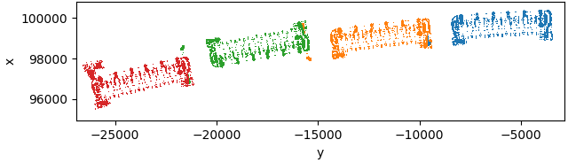
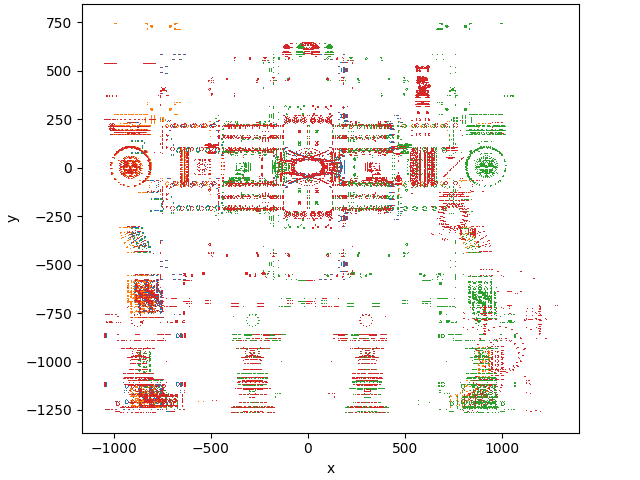
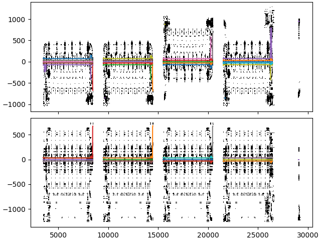
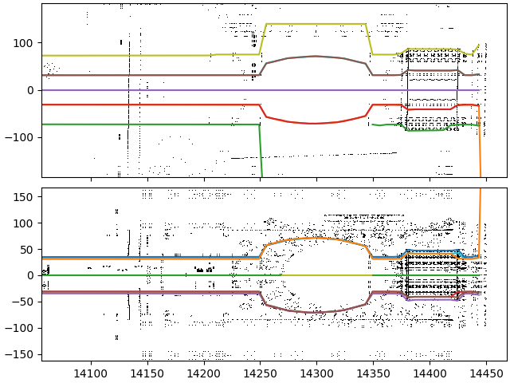
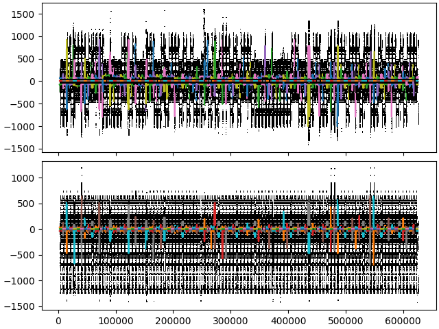
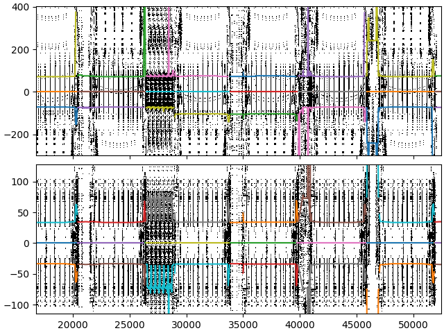

## Introduction

The __apres__ (**AP**erture **RE**construction **S**uite) package facilitates the automated reconstruction of mechanical apertures in accelerating rings and linacs alike. By leveraging the detailed and updated mechanical modeling from the CAD team, electrical apertures can be automatically reconstructed with the addition or replacement of new hardware along the beamline.

## Implementation

Firstly the __Aperture__ object must be imported and instantiated. 

```python
from glob import glob

from apres.apres import Aperture

files = glob('*.stl')[:5]
ps = Aperture(files)
```

For apertures with non-linear geometries, a __reference__ radius and __origin__ should be defined.

```python
from apres.shapes import IrregularRoundedPolygon

ps.reference = IrregularRoundedPolygon().radius,
ps.origin = (0, 0, 1260),
```

By default, the instantiated object will load the defined mesh files, addeding to the __tri__ attribute which can be depicted using the __show()__ method. 

```python
ps.show()
```



The __linearize__ method must be used to convert cartesian toroidal geometries to curvilinear toroidal-poloidal coordianates.

```python
ps.linearize()
ps.show()
```



One can then pass a __light source__ along the aperture center and compute ray intersections using the __inflate__ method. Ray source densities can also be specified for higher resolution apertures.

```python
pz.nth = 8
ps.nz = 1000
ps.inflate()

ps.plot_aperture()
```



Upon further inspection, one can notice details of certain aperture features such as bellows and pumpout ports.



The aperture intersection information is stored in ```.npy``` files adjacent to the source ```.stl```.

Inflating across the whole PS for example yields the following aperture reconstruction.



And again we can observe further detail upon zooming in.


